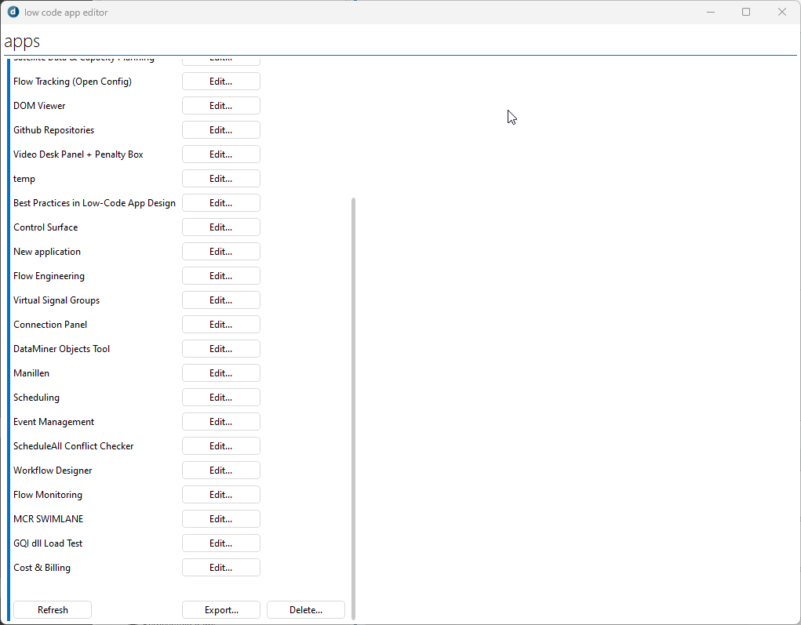
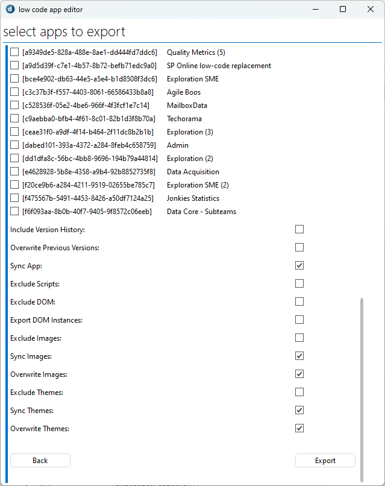
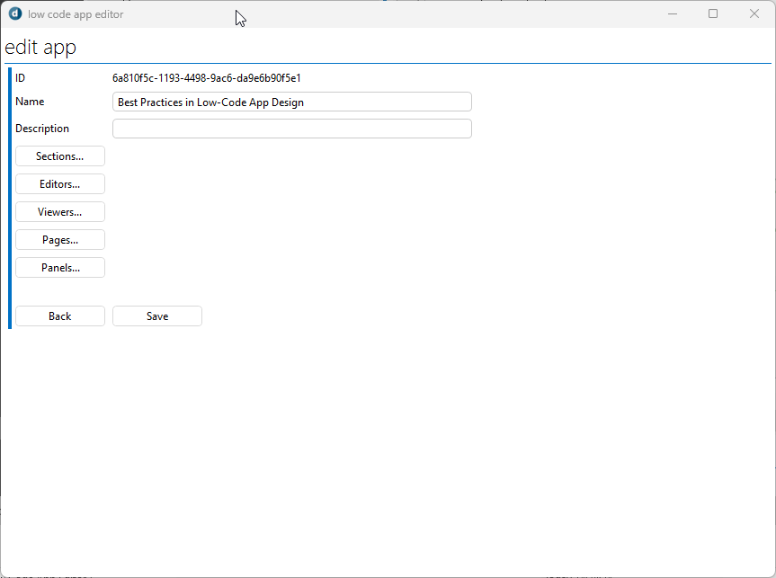

# Low Code App Editor

The **Low Code App Editor** simplifies managing low-code applications within the DataMiner System. It allows you to import, export, edit, and delete apps while offering customization options for metadata, resources, and deployment settings. With features like tailored export configurations and cross-agent synchronization, the tool streamlines app lifecycle tasks, making it a practical solution for maintaining and deploying low-code apps efficiently.

> [!IMPORTANT]
> After the deploy you'll need to manually replace on of the references.
>
> C:\Skyline DataMiner\ProtocolScripts\WebApiLib.dll needs to be C:\Skyline DataMiner\Webpages\API\bin\WebApiLib.dll

## Installation

#### Step 1: Deploy the Low Code App Editor package

1. Click the **Deploy** button to deploy the package directly to your DataMiner System.
1. Optionally, go to [admin.dataminer.services](https://admin.dataminer.services/) and verify whether the deployment was successfull.

#### Step 2: Update the WebApiLib reference

1. Connect to your DataMiner system using Cube.
1. Navigate to the Automation module and search for **Low Code App Editor** automation script.
1. Scroll down to the bottom and open the **Advanced** dropdown menu.
1. In the **DLL reference** text box replace the following line *C:\Skyline DataMiner\ProtocolScripts\WebApiLib.dll* with *C:\Skyline DataMiner\Webpages\API\bin\WebApiLib.dll*

## Use Cases

### Exporting Apps
You can export apps using this feature, which gathers all the necessary files for the selected apps and creates a .dmapp package. This package can then be installed on another system. The exported package is saved to the following directory: C:\Skyline DataMiner\Documents\DMA_COMMON_DOCUMENTS\Low Code Apps Exports.

For more details on the exporting functionality, see the more detailed information: [Low Code App Editor readme](https://github.com/SkylineCommunications/Low-Code-App-Editor/blob/main/README.md)

> [!NOTE]
> When exporting an app from one DMA to another, ensure that the versions match, for example GQI versions, to avoid compatibility issues.
>

## Editing Apps
You can edit various aspects of your low-code app's general information in this section. Additionally, you have the option to import pages and panels from other apps within the system to enhance functionality. The features you can manage here include the app's name, description, and sections. You can also define who can edit the app by selecting editors and specify access permissions by assigning viewers. Furthermore, you can expand the app's capabilities by integrating pages and panels from other apps.

> [!WARNING]
> When you add users to the editors/viewers list, there is no check if the users that you add actually exist.
>

## Support

For additional help, reach out to [arne.maes@skyline.be](mailto:arne.maes@skyline.be)