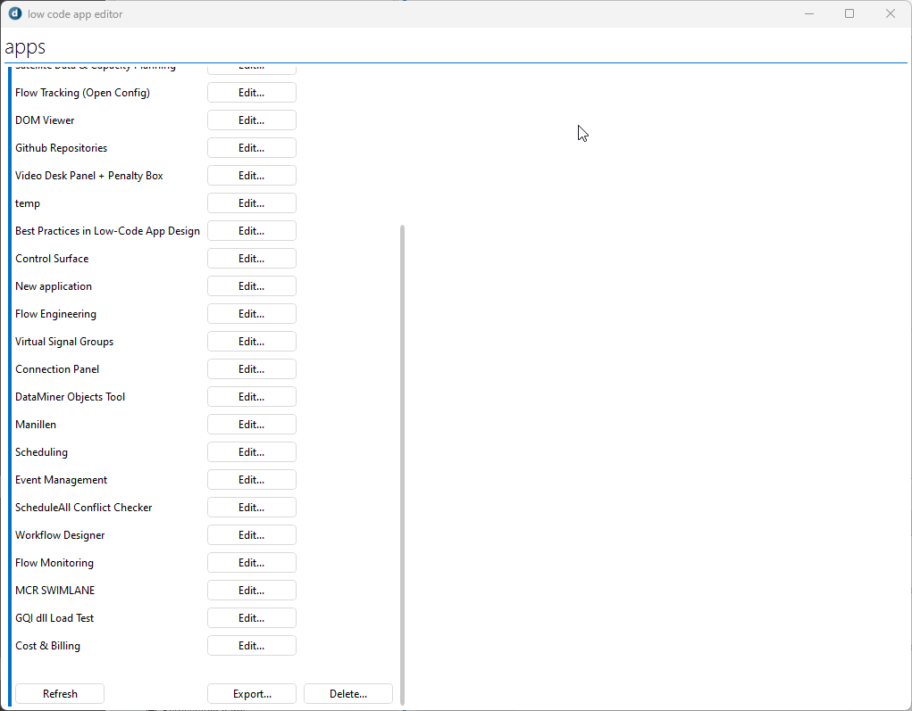
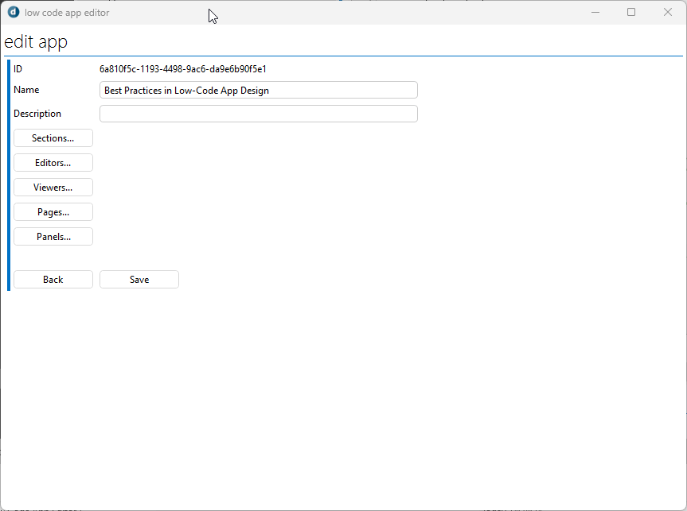
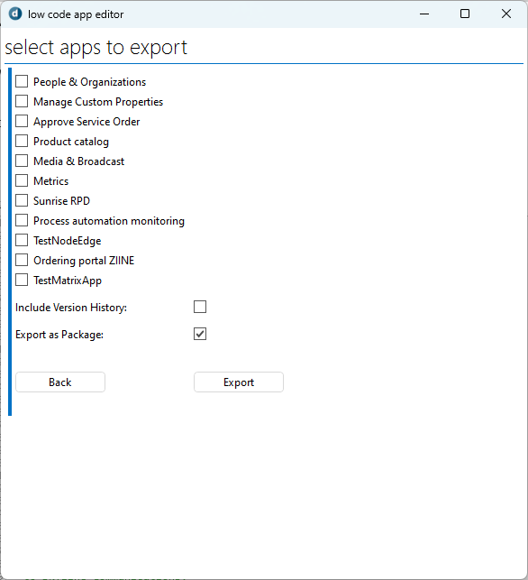
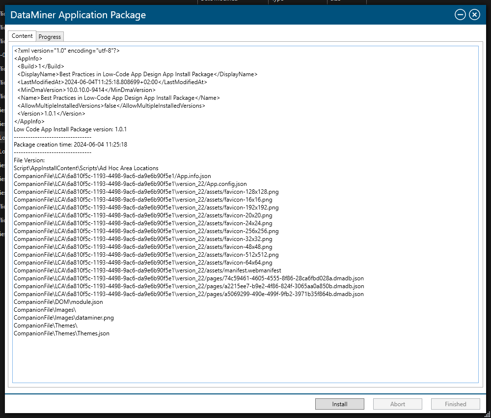
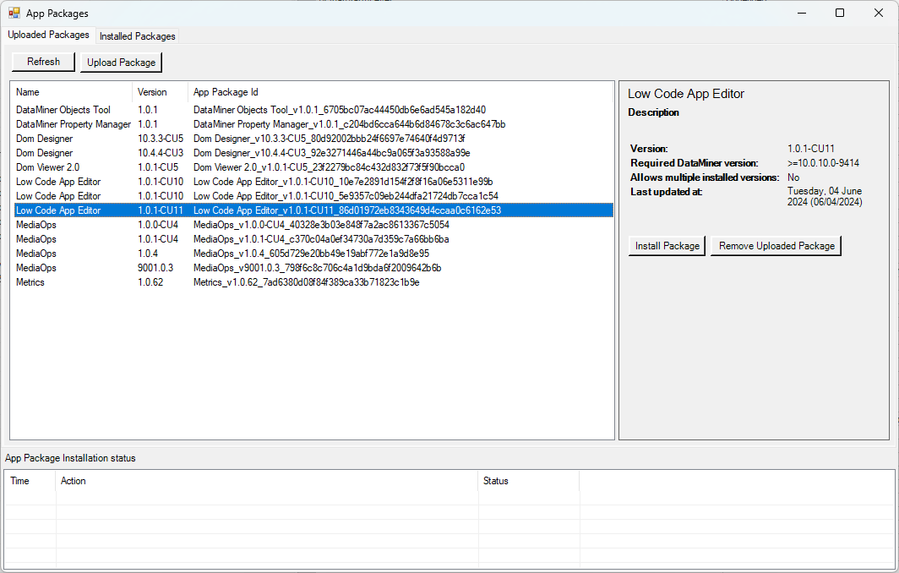
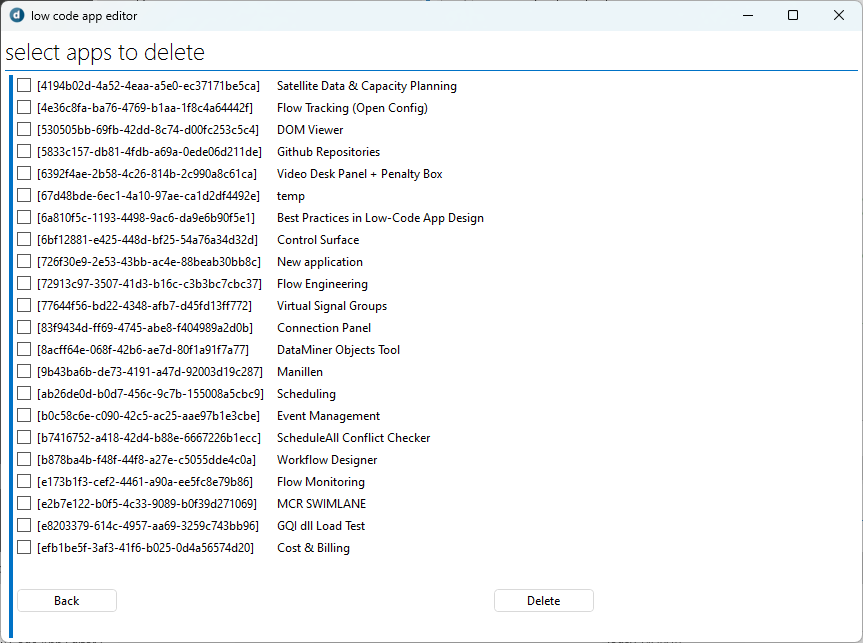

# Low-Code-App-Editor

An interactive Automation script to import, export, and do some general edits to the low-code apps of a DataMiner System.

## Installation

> [!WARNING]
> After the install you'll need to manually replace on of the references.
>
> C:\Skyline DataMiner\ProtocolScripts\WebApiLib.dll needs to be C:\Skyline DataMiner\Webpages\API\bin\WebApiLib.dll

### Catalog 
You can install the script through the catalog. 
1. Go to the [catalog](https://catalog.dataminer.services/).
1. Search for "Low Code App Editor".
1. Click *Deploy*.
1. Select the DMA you want to deploy to.
1. Click *Deploy*.
1. Open the Automation app on your DMA.
1. Go to the **Low Code App Editor** script.
1. Under *Advanced* > *DLL references*, replace **C:\Skyline DataMiner\ProtocolScripts\WebApiLib.dll** with **C:\Skyline DataMiner\Webpages\API\bin\WebApiLib.dll**.

### Manual
You can do a manual install by downloading the .dmapp package file from the releases.
1. Go to [releases](https://github.com/SkylineCommunications/Low-Code-App-Extensions/releases).
1. Download the .dmapp package from the latest version.
1. Install the package on your DMA.
1. Open the Automation app on your DMA.
1. Go to the **Low Code App Editor** script.
1. Under *Advanced* > *DLL references*, replace **C:\Skyline DataMiner\ProtocolScripts\WebApiLib.dll** with **C:\Skyline DataMiner\Webpages\API\bin\WebApiLib.dll**.

## Features

- [Edit](#edit)
- [Export](#export)
- [Import](#import)
- [Delete](#delete)

### Edit
You can edit some general information about the low-code app. You can import pages/panels from other apps in the system here as well.
1. Name
1. Description
1. Sections
1. Editors
1. Viewers
1. Pages
1. Panels

> [!WARNING]
> When you add users to the editors/viewers list, there is no check if the users that you add actually exist.
>

### Export
It is possible to export apps. We highly recommend enabling the option to export as a package, as this will try and collect all the used custom operators and action scripts and include them in the package. 

As of version 1.0.0.5, this script will also search through the GQI queries to look for used DOM modules and include them in the package as well. 

From version 1.0.0.6 onwards, you can enable an option to also include DOM instances in the package.

From version 1.0.0.9 onwards, the used images are included in the package as well.

From version 1.0.0.12 onwards, the used themes can be included as well.
#### Overview of included items
 - Custom operators
 - Configured action scripts
 - Dependencies of the used scripts
 - DOM modules
 - Images
 - Themes

> [!NOTE]  
> When exporting an app from one DMA to another, make sure the versions match (for example the GQI versions).

### Import 

Importing an exported .dmapp package can happen in a few different ways:

#### Taskbar Utility
If you have access to the DataMiner agent, you can copy over the .dmapp package and double click it to install it via the Taskbar Utility.

#### Client test tool
If you do not have RDP access to the DataMiner agent, but have a DataMiner user with the correct permissions. Then you can use the Client Test Tool to install packages too.

1. Open the Client Test Tool
1. In the tool bar go to "Connection" -> "Connect"
1. Enter you credentials and press "Connect"
1. in the tool bar go to "Advanced" -> "Apps" -> "AppPackages..."
1. Click on "Upload Package" and select the .dmapp package
1. Select the uploaded package in the list and press "Install Package"
1. [Optional] Remove the uploaded package by clicking "Remove Uploaded Package"

### Delete
You can delete apps as well.

## About DataMiner

DataMiner is a transformational platform that provides vendor-independent control and monitoring of devices and services. 
Out of the box and by design, it addresses key challenges such as security, complexity, multi-cloud, and much more. 
It has a pronounced open architecture and powerful capabilities enabling users to evolve easily and continuously.

The foundation of DataMiner is its powerful and versatile data acquisition and control layer. 
With DataMiner, there are no restrictions to what data users can access. 
Data sources may reside on premises, in the cloud, or in a hybrid setup.

A unique catalog of 7000+ connectors already exist. 
In addition, you can leverage DataMiner Development Packages to build your own connectors (also known as "protocols" or "drivers").

> [!NOTE]
> See also: [About DataMiner](https://aka.dataminer.services/about-dataminer).

## About Skyline Communications

At Skyline Communications, we deal in world-class solutions that are deployed by leading companies around the globe. 
Check out [our proven track record](https://aka.dataminer.services/about-skyline) and see how we make our customers' lives easier by empowering them to take their operations to the next level.
