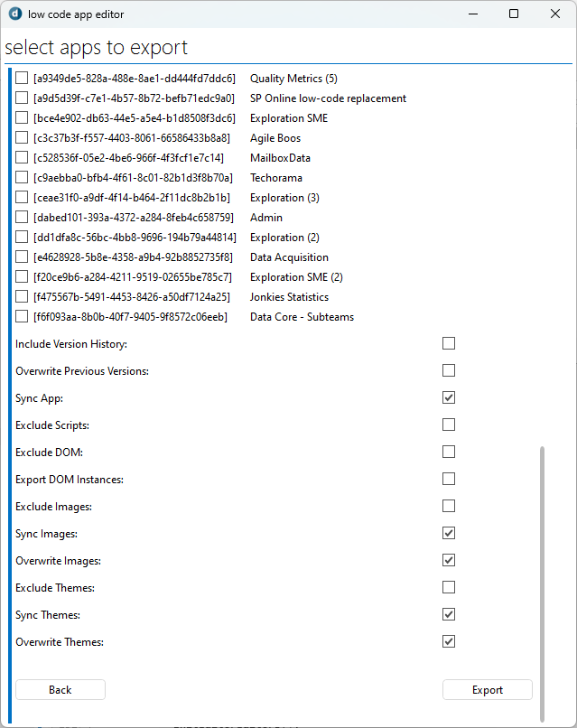

# Low-Code-App-Extensions

An Interactive Automation script to import, export and do some general edits to the low code apps of a DataMiner system.

## Installation

> **Warning**
> After the install you'll need to manuelly replace on of the references.
>
> C:\Skyline DataMiner\ProtocolScripts\WebApiLib.dll needs to be C:\Skyline DataMiner\Webpages\API\bin\WebApiLib.dll

### Cloud 
You can install the script through the catalog. 
1. Go to the [catalog](https://catalog.dataminer.services/)
1. Search for Low Code App Editor
1. Press Deploy
1. Choose the DMA you want to deploy to
1. Press Deploy
1. Open the Automation app on your DMA
1. Go to the **Low Code App Editor** script
1. Under Advanced > DLL references replace **C:\Skyline DataMiner\ProtocolScripts\WebApiLib.dll** with **C:\Skyline DataMiner\Webpages\API\bin\WebApiLib.dll**

### Manuel
You can do a manuel install by downloading the .dmapp package file from the releases.
1. Go to [releases](https://github.com/SkylineCommunications/Low-Code-App-Extensions/releases)
1. Download the .dmapp package from the latest version
1. Install the package on your DMA
1. Open the Automation app on your DMA
1. Go to the **Low Code App Editor** script
1. Under Advanced > DLL references replace **C:\Skyline DataMiner\ProtocolScripts\WebApiLib.dll** with **C:\Skyline DataMiner\Webpages\API\bin\WebApiLib.dll**

## Features

- [Edit](#edit)
- [Export](#export)
- [Import](#import)
- [Delete](#delete)

### Edit
You can edit some general information about the low code app.
1. Name
1. Description
1. Sections

### Export
There's the option to export apps. It is highly recommended enable the option to export as a package, as this will try and collect all the used custom operator and action script and include them in the package.

### Import 
This is used to import apps that have not been exported as a package. These will not include any of the custom scripts.

> **Warning**
> If you want to import .dmapp packages, you cannot do it with this import. You'll need to use the client test tool.

### Delete
You can delete apps as well.

## About DataMiner

DataMiner is a transformational platform that provides vendor-independent control and monitoring of devices and services. 
Out of the box and by design, it addresses key challenges such as security, complexity, multi-cloud, and much more. 
It has a pronounced open architecture and powerful capabilities enabling users to evolve easily and continuously.

The foundation of DataMiner is its powerful and versatile data acquisition and control layer. 
With DataMiner, there are no restrictions to what data users can access. 
Data sources may reside on premises, in the cloud, or in a hybrid setup.

A unique catalog of 7000+ connectors already exist. 
In addition, you can leverage DataMiner Development Packages to build you own connectors (also known as "protocols" or "drivers").

> **Note**
> See also: [About DataMiner](https://aka.dataminer.services/about-dataminer).

## About Skyline Communications

At Skyline Communications, we deal in world-class solutions that are deployed by leading companies around the globe. 
Check out [our proven track record](https://aka.dataminer.services/about-skyline) and see how we make our customers' lives easier by empowering them to take their operations to the next level.